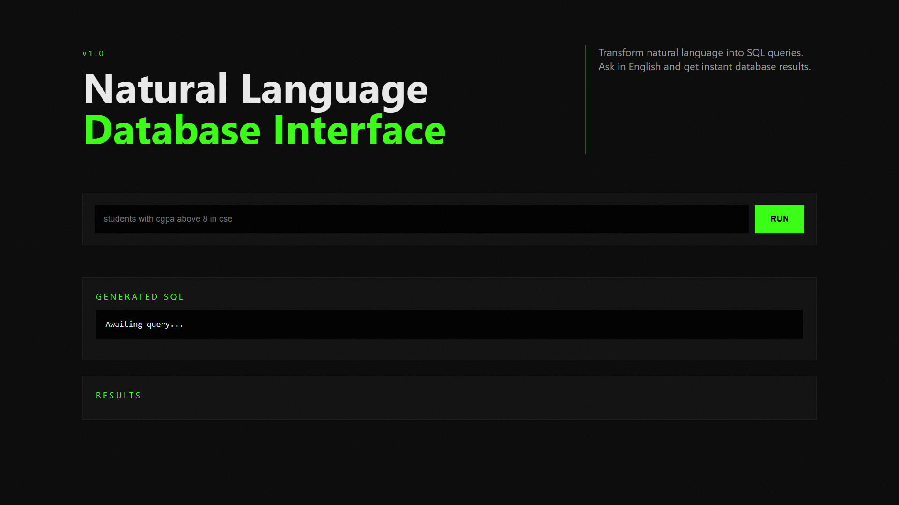
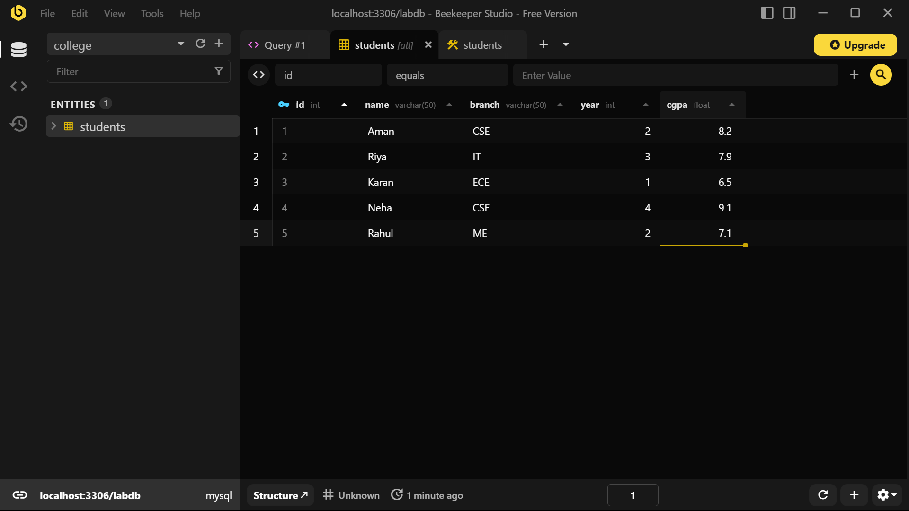
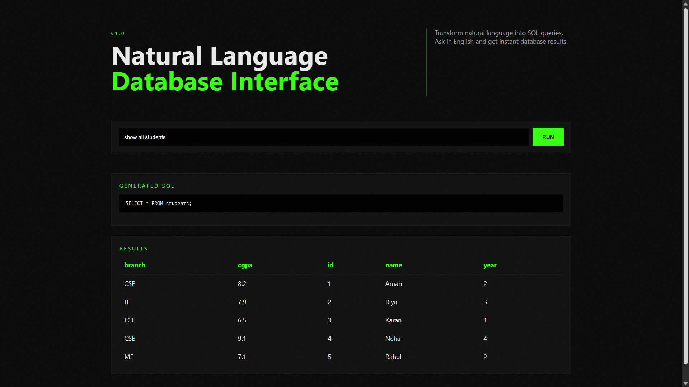
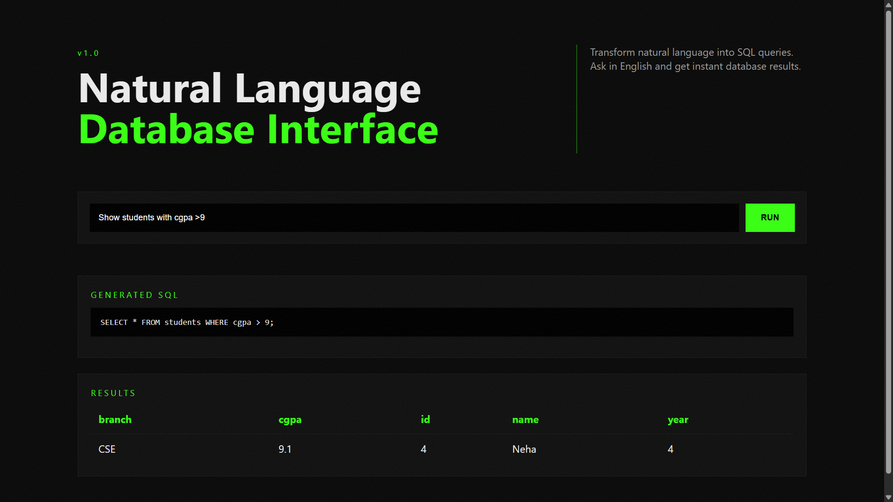

# NL-DB-LLM

**Natural Language → SQL → Database Results**

Ask questions in plain English.
The system converts them into SQL and runs them safely on a MySQL database.

---

## Overview

NL-DB-LLM is a lightweight full-stack application that lets users query a database without writing SQL.
A large language model generates the query, a Flask API validates it, and MySQL returns the results.

```
English → LLM → SQL → Database → Results
```

Designed for reliability, safety, and clarity — not just experimentation.

---

## Features

* Natural language to SQL using Groq Llama-3.3-70B
* Read-only safety guard (prevents destructive queries)
* Simple REST API
* Responsive dark UI
* Ready-to-demo academic architecture
* Clean modular backend structure

---

## Tech Stack

| Layer    | Technology        |
| -------- | ----------------- |
| Frontend | HTML, CSS, JS     |
| Backend  | Flask             |
| LLM      | Groq API          |
| Database | MySQL             |
| Security | SQL safety filter |

---

## Project Structure

```
nlp-db-llm/
│
├── backend/        API, DB access, SQL generation, safety
├── frontend/       UI
├── database/       Schema & seed data
├── models/         Prompt template
├── docs/           Report & screenshots
└── README.md
```

---

## Screenshots

### Home Interface



### SQL Table



### Output 1



### Output 2



---

## Setup

### 1. Clone repository

```
git clone https://github.com/agarwalaman598/nlp-db-llm.git
cd nlp-db-llm
```

### 2. Create Database

```
mysql -u root -p < database/schema.sql
```

### 3. Configure Environment

Create `.env` in project root:

```
DB_HOST=127.0.0.1
DB_USER=student
DB_PASSWORD=student123
DB_NAME=college
GROQ_API_KEY=your_key_here
```

### 4. Install dependencies

```
cd backend
pip install -r requirements.txt
```

### 5. Run backend

```
python -m backend.app
```

### 6. Run frontend

```
cd frontend
python -m http.server 5500
```

Open:

```
http://localhost:5500
```

---

## Example Queries

```
show all students
students with cgpa above 8
average cgpa
count cse students
students per branch
highest cgpa student
```

---

## API

### POST `/query`

Request:

```json
{
  "question": "show CSE students with CGPA above 8"
}
```

Response:

```json
{
  "sql": "SELECT * FROM students WHERE branch='CSE' AND cgpa > 8;",
  "result": [...]
}
```

---

## Safety Model

The system blocks any write or destructive operations:

```
INSERT
UPDATE
DELETE
DROP
ALTER
TRUNCATE
```

This prevents LLM hallucinations from modifying data.

---

## Design Goals

* Deterministic output
* Minimal hardware usage
* Cloud-LLM compatible
* Easy academic demonstration
* Replaceable database or model

---

## Limitations

* Schema currently optimized for a single table
* Keyword safety filter (not full SQL parser)
* No authentication (demo environment)

---

## Possible Extensions

* Multi-table support
* Query history
* Role-based access
* Schema auto-detection
* Production security layer

---

## License

Educational / demonstration use.

---

## Author
Aman
B.Tech Computer Science Engineering

---